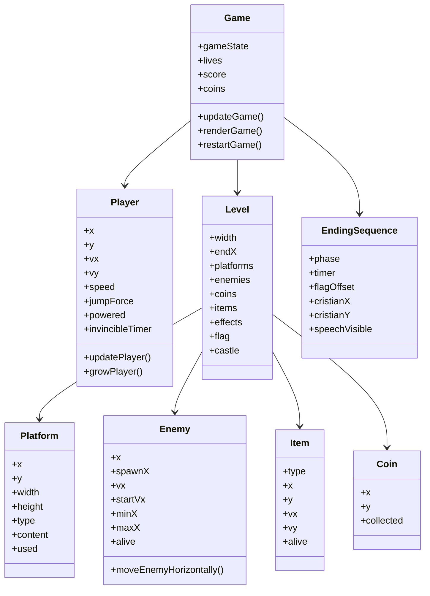

# Diagrama de classes

El joc esta implementat en JavaScript, pero aquest diagrama representa les entitats principals i les seves responsabilitats.

```mermaid
classDiagram
    class Game {
      +gameState
      +lives
      +score
      +coins
      +updateGame()
      +renderGame()
      +restartGame()
    }

    class Player {
      +x
      +y
      +vx
      +vy
      +speed
      +jumpForce
      +powered
      +invincibleTimer
      +updatePlayer()
      +growPlayer()
    }

    class Level {
      +width
      +endX
      +platforms
      +enemies
      +coins
      +items
      +effects
      +flag
      +castle
    }

    class Platform {
      +x
      +y
      +width
      +height
      +type
      +content
      +used
    }

    class Enemy {
      +x
      +spawnX
      +vx
      +startVx
      +minX
      +maxX
      +alive
      +moveEnemyHorizontally()
    }

    class Item {
      +type
      +x
      +y
      +vx
      +vy
      +alive
    }

    class Coin {
      +x
      +y
      +collected
    }

    class EndingSequence {
      +phase
      +timer
      +flagOffset
      +cristianX
      +cristianY
      +speechVisible
    }

    Game --> Player
    Game --> Level
    Level --> Platform
    Level --> Enemy
    Level --> Item
    Level --> Coin
    Game --> EndingSequence
```
