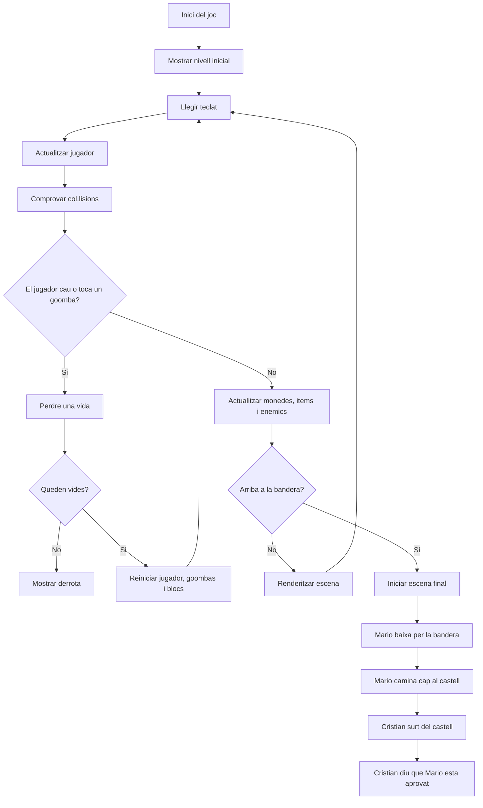

# Diagrama de comportament

Aquest diagrama mostra el flux principal del joc.

```mermaid
flowchart TD
    A["Inici del joc"] --> B["Mostrar nivell inicial"]
    B --> C["Llegir teclat"]
    C --> D["Actualitzar jugador"]
    D --> E["Comprovar col.lisions"]
    E --> F{"El jugador cau o toca un goomba?"}
    F -- "Si" --> G["Perdre una vida"]
    G --> H{"Queden vides?"}
    H -- "No" --> I["Mostrar derrota"]
    H -- "Si" --> J["Reiniciar jugador, goombas i blocs"]
    J --> C
    F -- "No" --> K["Actualitzar monedes, items i enemics"]
    K --> L{"Arriba a la bandera?"}
    L -- "No" --> M["Renderitzar escena"]
    M --> C
    L -- "Si" --> N["Iniciar escena final"]
    N --> O["Mario baixa per la bandera"]
    O --> P["Mario camina cap al castell"]
    P --> Q["Cristian surt del castell"]
    Q --> R["Cristian diu que Mario esta aprovat"]
```
